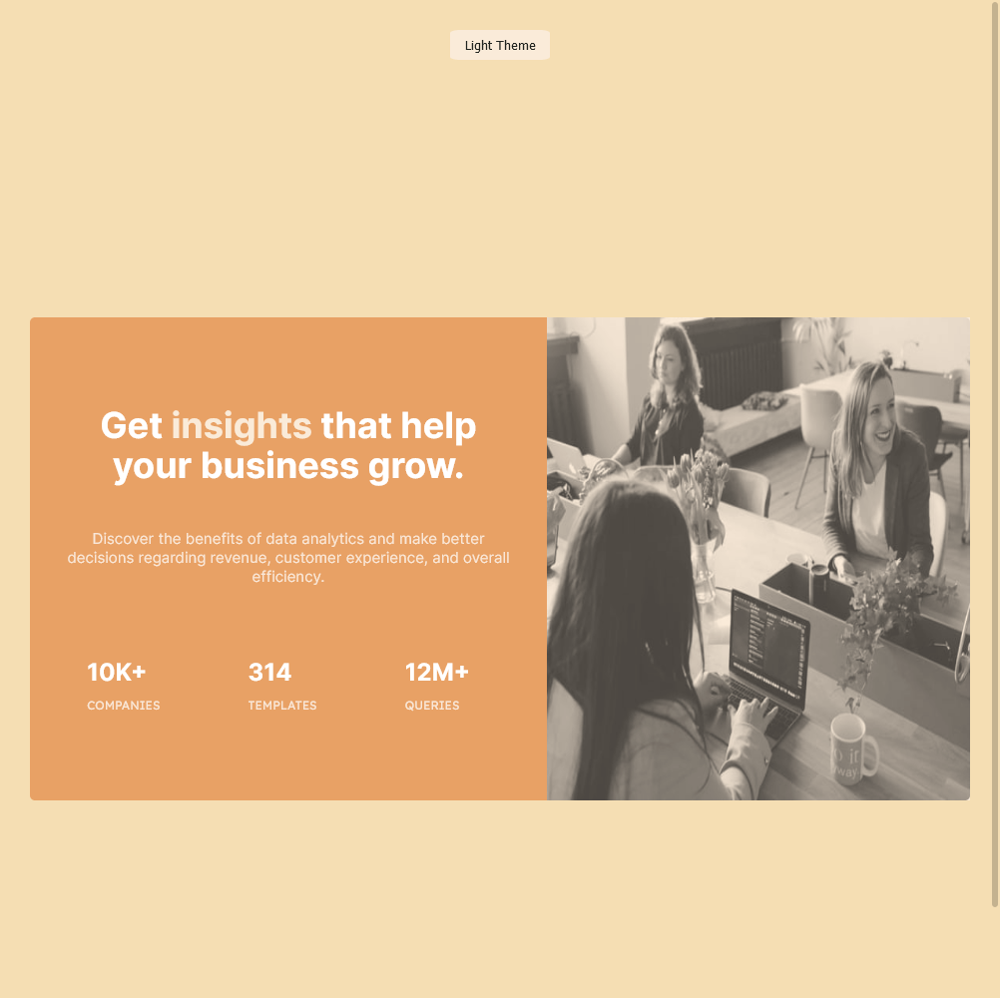
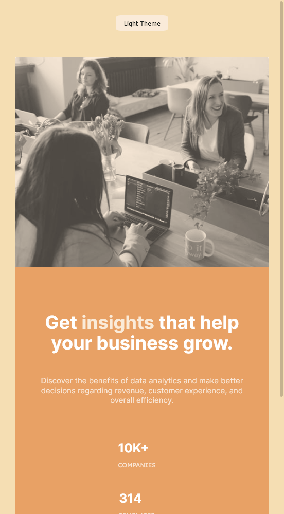

# Frontend Mentor - Stats preview card component solution

This is a solution to the [Stats preview card component challenge on Frontend Mentor](https://www.frontendmentor.io/challenges/stats-preview-card-component-8JqbgoU62). Frontend Mentor challenges help you improve your coding skills by building realistic projects. 

## Table of contents

- [Overview](#overview)
  - [The challenge](#the-challenge)
  - [Screenshot](#screenshot)
  - [Links](#links)
- [My process](#my-process)
  - [Built with](#built-with)
  - [Useful resources](#useful-resources)
- [Author](#author)

**Note: Delete this note and update the table of contents based on what sections you keep.**

## Overview

### The challenge

Users should be able to:

- View the optimal layout depending on their device's screen size
- Personally wanted to add Light/Dark Mode

### Screenshot

### Links

- Solution URL: [Add solution URL here](https://github.com/Ezmad-Ze/Stat-Preview-Card-Component)
- Live Site URL: [Add live site URL here](https://stat-preview-card-component.pages.dev/)

## My process

### Built with

- Semantic HTML5 markup
- SCSS
- CSS custom properties
- Flexbox
- CSS Grid
- Mobile-first workflow
- Javascript

### What I learned

I learned how to add Dark and Light modes in a website.
Learned SCSS. 

### Useful resources

- [Example resource 1](https://codyhouse.co/blog/post/dark-light-switch-css-javascript) - This helped me for the light and dark Mode 
- [Example resource 2](https://www.youtube.com/watch?v=uO3RF_67re8) - This is an amazing article which helped me finally understand  the light and dark Mode . I'd recommend it to anyone still learning this concept.

## Author

- Frontend Mentor - [@Ezmad-Ze](https://www.frontendmentor.io/profile/Ezmad-Ze)

